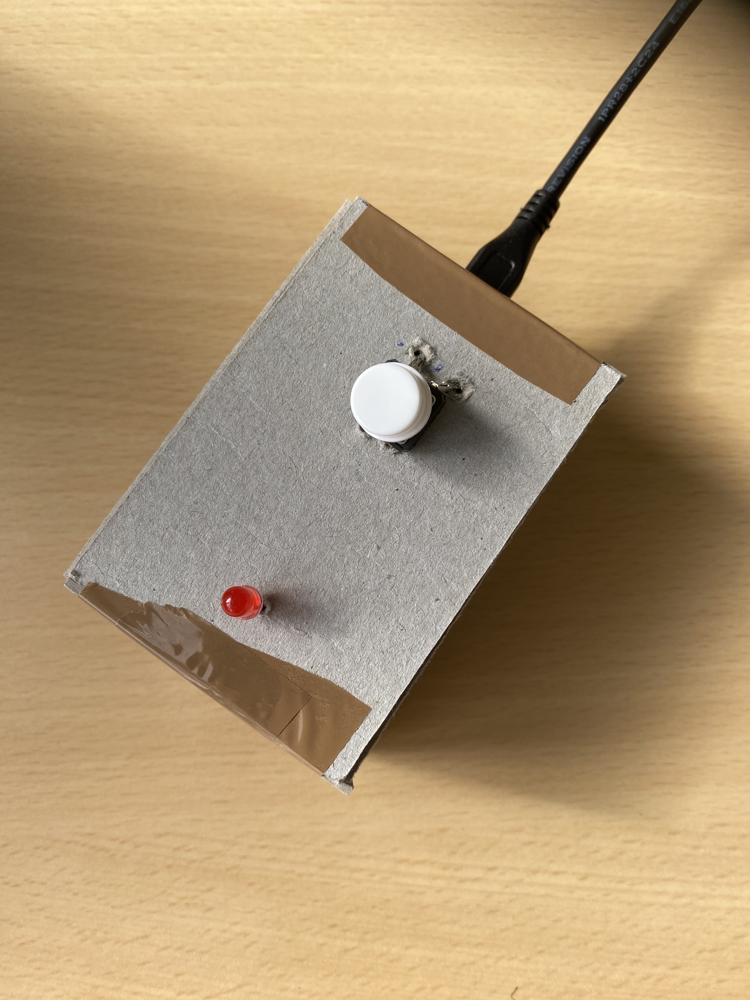
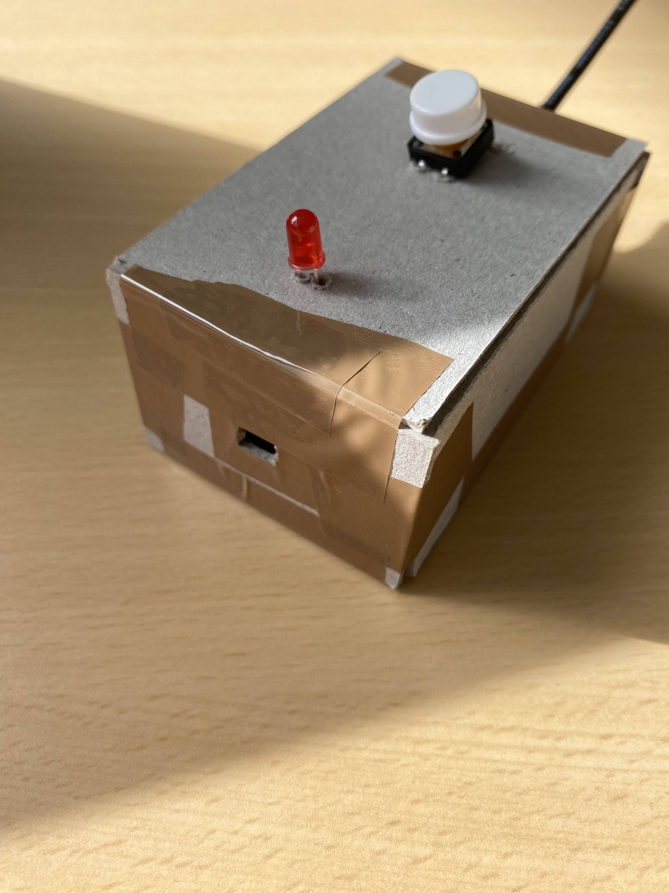
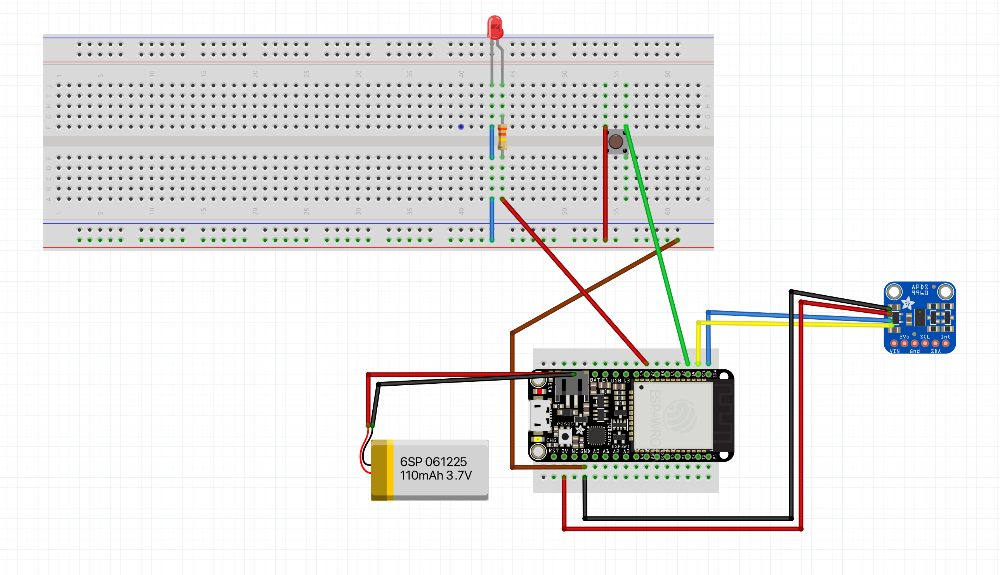

# ArduinoColorPalette

ArduinoColorPalette est un projet étudiant réalisé à deux dans le cadre du cours Arduino de la Haute École d'Ingénierie et de Gestion du Canton de Vaud (Suisse).    

Il s'agit d'un capteur permettant de générer une palette 6 couleurs à partir de la couleur détectée par un capteur. Le dispositif embarque un serveur web qui permet de servir une interface utilisateur pour afficher les couleurs générées par la palette. L’interface permet également de changer de mode de couleur parmi: analogue, triadique et complémentaire. 

Ce qui nous a motivés dans ce projet est la possibilité  d’intégrer un serveur web sur un Arduino afin de pouvoir communiquer entre un client web et l’Arduino au moyen de websockets.

__Images du prototype final__




# Résumé

- [ArduinoColorPalette](#arduinocolorpalette)
- [Résumé](#résumé)
- [Reproduire le projet](#reproduire-le-projet)
  - [1. Réaliser le circuit Arduino au moyen du plan fournis](#1-réaliser-le-circuit-arduino-au-moyen-du-plan-fournis)
  - [2. Construire l'interface](#2-construire-linterface)
  - [3. Installer les libraires arduino suivantes](#3-installer-les-libraires-arduino-suivantes)
  - [4. Upload les fichiers statiques sur l'Arduino](#4-upload-les-fichiers-statiques-sur-larduino)
  - [5. Connecter le serveur web au wifi](#5-connecter-le-serveur-web-au-wifi)
  - [6. Compilation et upload](#6-compilation-et-upload)
- [Difficultés rencontrées](#difficultés-rencontrées)
  - [1. Précision du capteur de couleur](#1-précision-du-capteur-de-couleur)
  - [2. Mise en place des libraires coté arduino](#2-mise-en-place-des-libraires-coté-arduino)
- [Améliorations potentielles](#améliorations-potentielles)
  - [1. Optimisation du capteur](#1-optimisation-du-capteur)
  - [2. Affichage de la palette sur l'appareil](#2-affichage-de-la-palette-sur-lappareil)
- [Quelques sources d'inspiration](#quelques-sources-dinspiration)

# Reproduire le projet

⚠️  Les exemples de code suivant partent du principe que l'installation se fait sur macOS au moyen du shell bash. Sur un autre système, les étapes et noms des dossiers peuvent un peu varier. De plus, la plupart des étapes demandent d'utiliser l'interface graphique de l'IDE Arduino. Il est bien sûr possible de réaliser toutes les étapes uniquement à la ligne de commande si vous savez ce que vous faites.

De plus, il est recommandé de disposer de deux versions de l'IDE Arduino. 

- Un IDE version 1.8: servira à uploader les fichiers statiques.
- Un IDE avec la dernière version disponible: pour le reste.

⚠️  À chaque fois que vous souhaitez uploader des fichiers statiques sur votre board, il est nécessaire de fermer le deuxième afin de ne pas occuper le port série nécessaire à l'upload des fichiers.

## 1. Réaliser le circuit Arduino au moyen du plan fourni

__Le plan du circuit__



__Les composants requis__

- La board ESP32 Feather
- Capteur de couleur: APDS9260
- Une batterie lipo de 110mAH: permet de rendre le dispositif autonome
- Une LED de couleur quelconque
- Un bouton
- une résistance de 330k Ohms

## 2. Construire l'interface

__Télécharger les fichiers sources__

```bash
git clone https://github.com/julessandoz/arduinoColorPalette
cd ArduinoColorPalette
```

__Modifier le fichier build.sh__

```bash
# Modifier le chemin vers le répertoire du projet arduino 
# selon le schéma suivant
dir="<chemin/vers/le/dossier/Arduino>/<nomDuSketch>/data"
# exemple
dir="/Users/user01/Documents/Arduino/monPremierSketch/data"
```

__Upload__

```bash
npm i
# construit le projet dans le répertoire dist
# et déplace le contenu de dist dans le répertoire du projet arduino
npm run upload
```

## 3. Installer les libraires Arduino suivantes

Une fois le projet ouvert dans l'IDE Arduino, installer les libraires suivantes.

- AsyncTCP
- ESPAsyncWebSrv
- SPIFFS
- Arduino_APDS9960

## 4. Upload les fichiers statiques sur l'Arduino

L'upload des fichiers statiques à servir par le serveur web est réalisé au moyen de __Arduino IDE__

⚠️  si l'upload est réalisé au moyen de __Arduino IDE__ il faut s'assurer que la version de l'ide n'est pas supérieure à __1.8__

__Marche à suivre__

1. Ouvrir le projet dans l'IDE
2. S'assurer que le bon port série est sélectionné
3. Ajouter le board pour ESP32
 - [SPIFFS Error: esptool not found!](https://rntlab.com/question/spiffs-error-esptool-not-found/)
4. Upload des fichiers: Outils->ESP32 Sketch Data Upload

## 5. Connecter le serveur web au wifi

Ouvrir le sketch Arduino avec l'IDE Arduino et compléter les lignes suivantes tout en haut du fichier avec vos informations de connexion.

```c
static const char* ssid = "Le nom de votre réseaux wifi ici";
static const char* password = "Votre mot de passe ici";
```

Afin de pouvoir consulter le site web sur un navigateur, il est nécessaire d'être connecté au même réseau wifi que le serveur. L'adresse du site web est affichée dans le Serial moniteur de l'IDE Arduino sur `115200`.

## 6. Compilation et upload

Vous pouvez à présent compiler et uploader votre code sur votre ESP32 au moyen de l'IDE Arduino.

📚 A des fins de débogage vous pouvez consulter les logs du programme sur le `baude rate 115200`

# Difficultés rencontrées

## 1. Précision du capteur de couleur

Le capteur de couleur enregistre des valeurs RGB supérieures à 255 lorsque la luminosité ambiante est trop élevée. Ainsi afin d'éviter les cas où la luminosité ambiante serait trop néfaste à la précision du capteur, nous avons fait le choix d'empêcher la capture de couleur au-dessus d'un certain seuil de luminosité. C'est la raison de la présence de la LED sur le dispositif. Lorsque la LED est éteinte, cela signifie que la luminosité ambiante est trop élevée et que donc la capture est impossible. 

Afin d'améliorer davantage la précision du capteur, nous avons entrepris d'implémenter côté front un dispositif de calibrage des couleurs. Pour ce faire, l'interface montre tour à tour un échantillon de rouge, vert et bleu. L'utilisateur doit alors scanner ces couleurs l'une après l'autre. 

Le résultat de la capture est alors comparé à la valeur présentée sur l'interface. La différence est alors stockée sous forme de pourcentage dans le LocalStorage du navigateur web. Puis à chaque nouvelle capture, la différence pour la valeur de rouge, de vert et de bleu est ajoutée à la couleur captée. 

Cependant, ce procédé n'est pas vraiment fiable, car les résultats dépendent grandement de la luminosité de l'écran de l'ordinateur. De plus, il faudrait que la luminosité ambiante présente lors de la calibration soit la même lors des captures suivantes pour donner du sens aux résultats, ce qui est difficile. En fin de compte malgré la mise en place de cette option de calibration la précision du capteur n'a pas vraiment été améliorée.

## 2. Mise en place des libraires cotés Arduino

Grâce aux libraires externes, la quantité de code écrite par nos soins est finalement assez faible. Cependant, il a parfois été compliqué de faire fonctionner lesdites libraires sur nos ordinateurs respectifs. Nous avons en effet passé beaucoup de temps à lire la documentation et les forums afin d’ installer et d’utiliser les libraires dont nous avions besoin, faute souvent à un manque de documentation du côté des libraires ou à des incompatibilités système qu'il nous a fallu régler. Nous avons notamment rencontré des difficultés à uploader des fichiers sur l’Arduino avec la librairie SPIFFS en raison d'un package nommé esptool non compatible avec la dernière version de l’IDE Arduino ce qui nous à obligé à réaliser tous les uploads des fichiers statiques au moyen de l’IDE Arduino en version 1.8. comme indiqué dans l’étape installation.

# Améliorations potentielles

## 1. Optimisation du capteur

Pour régler les problèmes de captation de la couleur dus à la lumière ambiante, le capteur pourrait être protégé de la lumière extérieure et éclairé par une LED attachée. Cela permettrait au capteur de toujours faire son travail dans des conditions optimales.

## 2. Affichage de la palette sur l'appareil

Nous aurions aimé ajouter un affichage de la palette de couleurs directement sur le capteur en plus de l'interface web. Ceci pourrait être réalisé à l'aide de LED RGB par exemple.

# Quelques sources d'inspiration

- [How to make Color Detector using TCS230 | TCS3200 Color Sensor, Arduino and LCD Display](https://www.youtube.com/watch?v=HsjrcjRNFwk)
- [Arduino Based Real Life RGB Colour Picker - Make Your Own](https://www.youtube.com/watch?v=JeYrPW01xNA)

